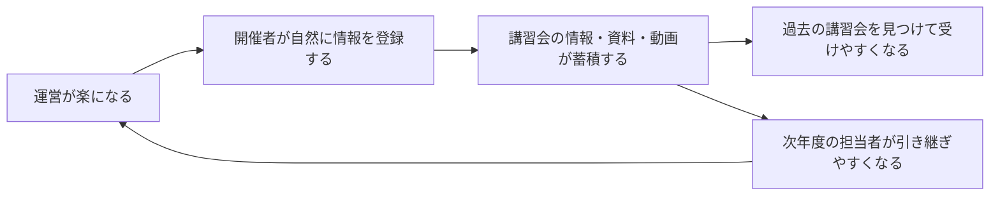
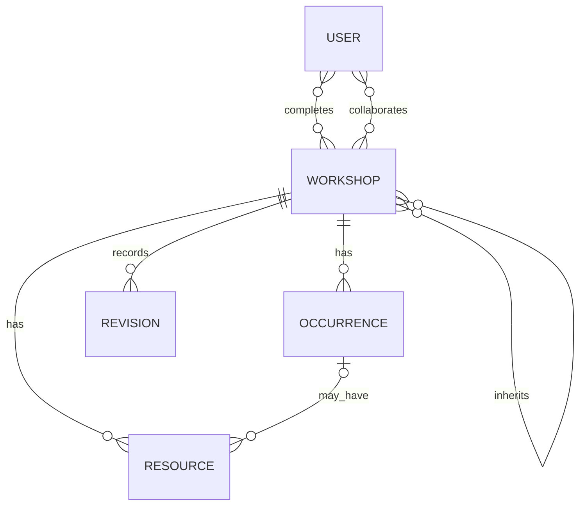

# LeQtures — traP 講習会の体験設計

## 一言でいうと

LeQturesは、講習会の準備に必要な情報を迷わず整えられ、そのまま次の受講者と次年度の開催者に残るサービス。

## 目指す循環

最終目的はアーカイブそのものではなく、過去の講習会を後から受けやすくすること。そのために、情報を残す側にも直接の利点がある運営体験を作る。

## 情報を届けたい3人

1. これから開催される講習会へ参加する人
2. 開催後に資料や動画から受講する人
3. 次年度に同じ講習会を担当する人

この3人に必要十分な情報を、入力項目を増やしすぎずに残す。

## 中心となる体験

### 開催者

1. 新しい講習会を作るとき、対応する過去の講習会を探す。
2. 過去版を引き継ぐか、白紙から始める。
3. 引き継いだ場合は名前、説明、対象者、対象班、0→1、運営元、前提・おすすめと、開催枠のタイトル・内容・関係を再利用する。運営メンバー、チャンネル、各枠の日時・形式・場所・講師・knoQ、今回の資料と動画は空にする。
4. 全体の入力項目と進み具合を見ながら、好きな順番で情報を埋める。
5. 入力済みの情報からtraQ告知文とknoQ説明文を生成し、コピーして使う。自動投稿はしない。
6. 情報が揃う前でも公開できる。公開後に決まった項目を随時追記する。
7. 開催後に資料・動画を同じページへ追加し、次の人が受講できる状態にする。

### 受講者

1. 名前・分野・対象者で検索し、資料あり・動画あり・記録のみで絞り込む。
2. 対応する年度が複数あるときは、条件に合う最新の講習会を見る。最新年度に動画がなく過年度にある場合、動画検索では動画がある最新の過年度版を見る。
3. 公開ページで、参加前も開催後も同じ項目を同じ順番で確認する。
4. 開催枠へ参加するか、過去の資料・動画から受講する。
5. 本人の判断で講習会全体を受講完了にし、バッジを得る。
6. バッジは初期状態では非公開。選んだバッジだけをtraQやSNSへ共有できる。

## 講習会ページの情報

情報の表示順は、開催前後で変えない。未定の項目があってもページを公開できる。

1. 基本情報：名前、開催年度、説明、運営元、運営メンバー、対象者、対象班、0→1、traQチャンネル
2. 開催枠：各枠のタイトル、内容、日時、形式、場所・参加先、講師、knoQ
3. 資料・動画：講習会全体のものと、各開催枠に対応するもの
4. 関連する講習会：直近の過年度版、前提、次のおすすめ
5. 振り返り・出典・公開後の編集履歴

## 講習会と開催枠

- 「2026年度 Git講習会」のような年度ごとのまとまりを1つの講習会とする。
- 同じ内容を別日に行う場合も、内容の異なる第1回・第2回も、それぞれを開催枠として登録する。
- 開催枠どうしの関係は講習会全体で表す。1回完結、順番に受講、同内容から1つ選択、本編と再放送を扱う。
- 資料・動画は講習会共通にも、特定の開催枠にも結び付けられる。
- 受講完了は当面、開催枠ごとではなく講習会全体に対して記録する。

年度が違えば別の講習会として登録する。単なる年度切替ではなく、引き継ぎ元への辺を持つため、分岐があってもたどれる。

## 公開状態と編集

- 下書き：作成者と追加された共同編集者だけが閲覧・編集できる。
- 公開：認証済みのtraPメンバーなら閲覧・編集できる。保存された変更は編集履歴に残る。インターネット全体への閲覧公開は後から選べる設計にする。
- 公開に必要な必須情報はほとんど設けない。未入力を理由に告知や情報共有を止めない。

## 今回扱わないもの

- 講習会準備のためのミーティング管理
- knoQ・traQ・Wikiへの自動投稿
- ロードマップ
- 開催枠単位の受講完了条件

## 未決定

- 公開講習会をtraP内だけに見せるか、インターネット全体にも見せるか
- 複数の開催枠のうち、どこまで受講すれば講習会完了とするか

## デモの範囲

デモでは検索、引き継ぎ、編集、公開、受講完了、バッジ共有までを操作できる。変更はブラウザ内だけに保存し、traQ・knoQ・Wikiへの書き込みは行わない。
