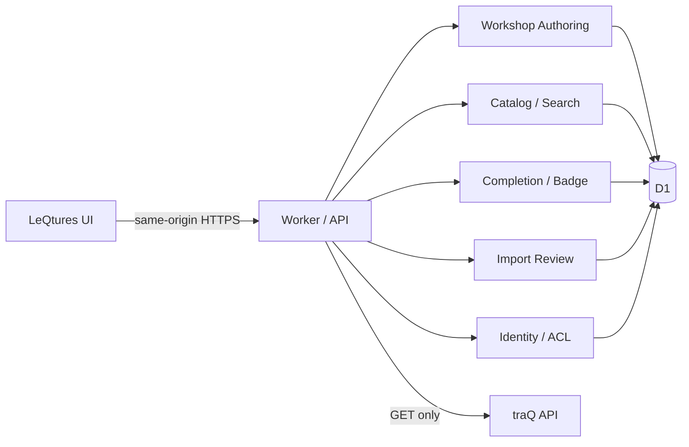
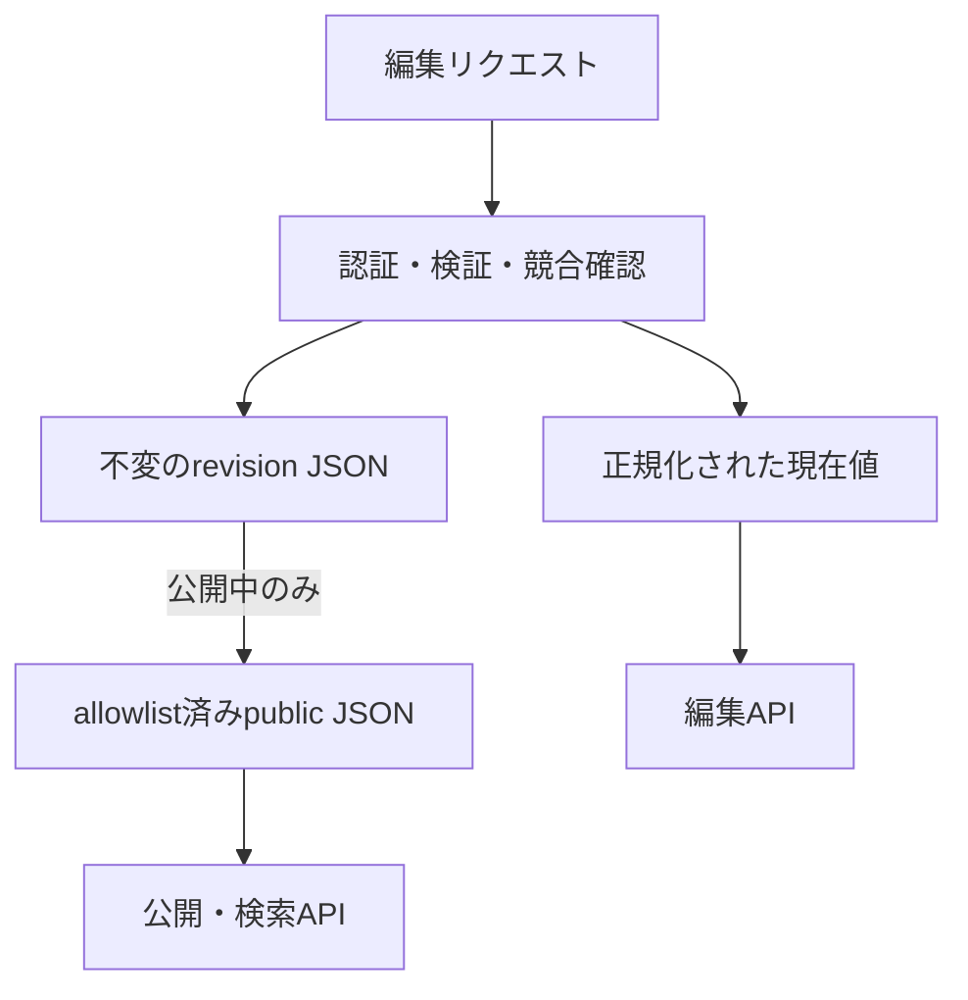
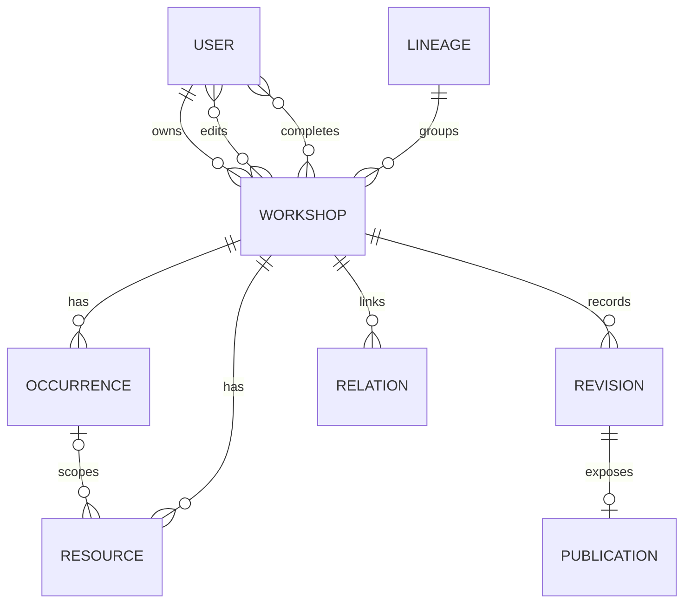

# LeQtures バックエンド設計 v1

この文書は、現在のデモを「複数人が実際に使えるプロダクト」へ移行するための実装仕様である。講習会そのものの正規データは [`workshop-schema.md`](./workshop-schema.md) を基準とし、この文書では永続化、API、認証・認可、履歴、検索、外部連携を定義する。

## 1. 結論

v1 は、Cloudflare Worker と D1 を使った単一バックエンドにする。マイクロサービス、キュー、独自ファイルストレージは導入しない。

- 構造化データは D1 に保存する。`localStorage` は一時的なUI状態だけに限定する。
- 資料・動画の本体は保存せず、外部URLだけを保存する。そのため、v1 では R2 を使わない。
- 実運用の本人確認は traP の OIDC/OAuth を使い、LeQtures独自のパスワードは持たない。
- ブラウザは同一オリジンの `/api/v1` だけを呼ぶ。traQ のトークンはサーバー外へ出さない。
- 現在の編集状態は正規化テーブル、履歴は変更不能なJSONスナップショット、公開ページは公開項目だけのJSONスナップショットとして分ける。
- 公開後の編集は即時反映する。ただし、全変更に編集者と改訂番号を残し、競合を検知し、過去版へ戻せるようにする。
- 画面上の Step は入力支援の構成であり、DBの構造やAPIの境界にはしない。Stepを後から組み替えてもデータ移行を不要にする。
- 受講完了は、当面「本人が講習会全体について記録する自己申告」とする。バッジは受講完了データから導出する。



## 2. ドメイン境界

単一のWorker内を、次の5モジュールに分ける。別サービスには分割しない。

| モジュール | 責務 |
|---|---|
| Identity / Directory | ログイン、セッション、ユーザー・グループ・チャンネル候補の検索 |
| Workshop Authoring | 下書き、共同編集、基本情報、開催枠、場所、資料、関連、公開、改訂 |
| Catalog / Search | 公開講習会の一覧・詳細、「条件に合う最新年度」の選択 |
| Completion / Badge | 自分の受講完了、バッジ、明示的な共有リンク |
| Import / Provenance | 過去データの取込候補、出典、重複確認、承認・却下 |

`Workshop` を編集の集約単位にする。開催枠、資料、関連講習会の1変更でも、講習会全体の `version` が1つ増える。

## 3. 認証

### 3.1 実運用

実運用では traP の OIDC プロバイダーを第一候補とし、Authorization Code Flow と PKCE を使う。OIDC discovery、issuer、client ID、callback URL、scope は実環境の設定を正本とし、コードへ固定しない。

認証後は次の流れにする。

1. サーバーが provider の本人情報から安定した subject を取得する。
2. 可能なら traQ のユーザーUUIDへ対応付ける。表示名や `@name` は本人IDに使わない。
3. ブラウザへはランダムなセッションIDだけを `HttpOnly; Secure; SameSite=Lax` Cookieで渡す。
4. DBにはセッションIDのハッシュを保存する。OIDC/OAuthのアクセストークンは、継続利用が不要ならcallback処理後に破棄する。
5. セッションには有効期限を設け、ログアウト時は即時失効する。

現行のSitesデモではプラットフォームの認証済みユーザーヘッダーを使うアダプターを用意できるが、これはtraP会員であることやtraQユーザーとの対応を証明しない。したがって本番用の認証方式にはしない。

```ts
interface IdentityProvider {
  authenticate(request: Request): Promise<AuthenticatedIdentity | null>;
}

type AuthenticatedIdentity = {
  issuer: string;
  subject: string;
  traqUserId: string | null;
  displayName: string;
};
```

実装は `PortalOidcIdentityProvider`、デモ用は `SitesHeaderIdentityProvider`、ローカル用は開発時だけ有効な `LocalIdentityProvider` とする。後二者は本番環境で有効化しない。

### 3.2 セッションとCSRF

- 書き込みAPIはCookie認証に加え、同一オリジン確認とCSRFトークンを要求する。
- OAuth/OIDC callbackでは `state`、`nonce`、PKCE、issuer、redirect URIを検証する。
- actor、時刻、権限をリクエスト本文から受け取らない。
- セッションCookie、Bot Token、アクセストークンをログへ出さない。

## 4. 認可

「公開後は誰でも編集できる」の「誰でも」は、v1では認証済みのtraPメンバーとする。匿名編集は許可しない。

| 操作 | 権限 |
|---|---|
| 下書きの閲覧・編集 | 作成者、明示的な共同編集者 |
| 共同編集者の追加・削除 | 作成者 |
| 下書きの公開 | 作成者、共同編集者 |
| 公開済み講習会の閲覧 | v1では認証済みtraPメンバー |
| 公開済み講習会の通常編集 | 認証済みtraPメンバー |
| 講習会のアーカイブ・復元 | 作成者または管理者。ownerのない取込レコードは管理者 |
| 改訂履歴の閲覧 | 下書きは編集者、公開後は認証済みtraPメンバー |
| 過去版への復元 | 公開後は認証済みtraPメンバー。濫用時は管理者限定へ切替可能 |
| 自分の受講完了・バッジ設定 | 本人のみ |
| 取込候補の承認・却下 | reviewerまたはadmin |
| セキュリティ監査ログ | 管理者 |

Step 1 の「運営メンバー」は公開情報であり、編集権限ではない。`workshop_operators` と `workshop_editors` は必ず別テーブルにする。

インターネット全体へ公開する場合も、書き込みAPIはtraPログイン必須のままとする。その場合は匿名向け公開DTOに、traQ UUID、共同編集者、非公開バッジ、下書き、運営専用状態を含めない。

## 5. データの三層

### 5.1 現在値

編集と検索に使う正規化テーブル。開催枠や資料を部分更新しやすくする。

### 5.2 改訂スナップショット

保存が成立するたびに `workshop_revisions` へ講習会集約全体のJSONを追記する。既存行は更新・削除しない。

- 差分表示は連続する2つのJSONから生成する。
- 復元は過去のポインターへ戻さず、過去の内容をコピーした新しい改訂を作る。
- 共同編集者、セッション、バッジ、運営用 `workflow` は講習会内容の改訂JSONに入れない。

### 5.3 公開スナップショット

公開時、および公開済み講習会の保存時に、公開を許可した項目だけを `workshop_publications.public_json` へ保存する。公開APIはこのJSONを返す。

これにより、子テーブルを順に更新している途中の状態や、`workflow.setupRequested`、共同編集者ACL、生成文などが公開レスポンスへ混ざることを防ぐ。



## 6. D1テーブル

IDはサーバー生成のUUIDを使う。時刻はUnix millisecondsの `INTEGER`、日付と時刻は `YYYY-MM-DD` と `HH:mm` の `TEXT` で持つ。時刻のタイムゾーンは `Asia/Tokyo` 固定とする。



### 6.1 ユーザーと認証

#### `users`

| 列 | 型 | 制約・意味 |
|---|---|---|
| `id` | TEXT | PK、LeQtures内部ID |
| `traq_user_id` | TEXT | UNIQUE NULL、対応するtraQ UUID |
| `name_snapshot` | TEXT | 最後に確認した表示名 |
| `created_at_ms` | INTEGER | NOT NULL |
| `updated_at_ms` | INTEGER | NOT NULL |

#### `auth_identities`

`(issuer, subject)` を複合主キーとし、`user_id`、`created_at_ms`、`last_authenticated_at_ms` を持つ。認証providerのsubjectはこのテーブルだけに保存する。

共同編集者はログイン前でもtraQ UUIDで追加できる。その場合は `traq_user_id` と名前だけを持つ `users` 行を先に作り、本人が初めてログインした時に、検証済みのtraQ UUIDを使って `auth_identities` と結び付ける。表示名や文字列一致だけでアカウントを統合しない。

#### `sessions`

| 列 | 型 | 制約・意味 |
|---|---|---|
| `token_hash` | TEXT | PK。Cookieの平文値は保存しない |
| `user_id` | TEXT | FK `users` |
| `expires_at_ms` | INTEGER | NOT NULL |
| `created_at_ms` | INTEGER | NOT NULL |
| `last_seen_at_ms` | INTEGER | NOT NULL |
| `revoked_at_ms` | INTEGER | NULL |
| `csrf_token_hash` | TEXT | NOT NULL |

#### `user_roles`

`(user_id, role)` を複合主キーとする。v1のroleは `admin`、`importer`、`reviewer`。

OIDC開始からcallbackまでの短い状態は `oauth_transactions(state_hash, nonce_hash, pkce_verifier_ciphertext, encryption_key_id, return_to, expires_at_ms, created_at_ms)` に置く。callbackでは有効期限、state、nonce、PKCEを検証し、条件付き `DELETE ... WHERE state_hash = ? AND expires_at_ms > ?` の変更行数が1件だった時だけ使用済みとする。PKCE verifierはSecretsで管理する暗号鍵で暗号化し、鍵IDを併記してローテーションできるようにする。

収集器用には `service_tokens(id, token_hash, name, scopes_json, expires_at_ms, revoked_at_ms)` を使い、`id` を主キー、`token_hash` をUNIQUEにする。一般ユーザーのsessionとは分け、各履歴・監査行にはこの安定IDを保存する。

### 6.2 traQ参照キャッシュ

候補検索を毎回traQ全件取得にしないための短時間キャッシュ。権限判定の正本には使わない。v1の共有キャッシュへ入れるチャンネルは、traQの公開一覧で得られる公開チャンネル、または管理者が明示的に承認した公開候補だけに限定し、Botだけが見られる非公開チャンネルは保存しない。

- `traq_actors(traq_id, kind, name, display_name, icon_ref, active, synced_at_ms)`
- `traq_channels(traq_id, name, path, archived, synced_at_ms)`

`kind` は `user | group`。`icon_ref` はサーバーだけが解釈する参照で、APIは同一オリジンのアイコンURLを返す。アイコンがない場合は `icon_ref = NULL` とし、代替文字アイコンを作らない。

### 6.3 講習会

#### `workshop_lineages`

`id` と `created_at_ms` のみを持つ。同じ内容を年度ごとに引き継ぐ系列を表す。

#### `workshops`

| 列 | 型 | 制約・意味 |
|---|---|---|
| `id` | TEXT | PK |
| `lineage_id` | TEXT | FK NULL |
| `title` | TEXT | NOT NULL。作成時に仮名を確定する |
| `academic_year` | INTEGER | NOT NULL、4月始まりの年度 |
| `description` | TEXT | NULL |
| `organizer_source` | TEXT | NULL、7班 / unders / 個人・有志 |
| `audience` | TEXT | NULL |
| `is_zero_to_one` | INTEGER | NULL、0 / 1 |
| `channel_id` | TEXT | NULL、traQ UUID |
| `channel_path_snapshot` | TEXT | NULL。未解決ならパスだけでも保存可 |
| `retrospective_url` | TEXT | NULL |
| `operators_state` | TEXT | `unknown | known` |
| `target_teams_state` | TEXT | `unknown | known` |
| `occurrences_state` | TEXT | `unknown | known` |
| `resources_state` | TEXT | `unknown | known` |
| `lifecycle` | TEXT | `draft | public | archived` |
| `archived_from` | TEXT | NULLまたは `draft | public`。復元先を保持 |
| `owner_user_id` | TEXT | FK NULL。手動作成のdraftでは必須、取込由来のpublicではNULL可 |
| `creator_principal_kind` | TEXT | `user | service` |
| `creator_principal_id` | TEXT | user IDまたはservice token ID |
| `version` | INTEGER | NOT NULL、単調増加 |
| `acl_version` | INTEGER | NOT NULL、共同編集者変更用 |
| `last_mutation_token` | TEXT | NULL、D1 batch内の競合ガード |
| `head_revision_id` | TEXT | FK NULL |
| `active_publication_id` | TEXT | FK NULL |
| `created_at_ms` | INTEGER | NOT NULL |
| `updated_at_ms` | INTEGER | NOT NULL |
| `published_at_ms` | INTEGER | NULL |
| `archived_at_ms` | INTEGER | NULL |

講習会名が未入力でも作成できるよう、`POST /workshops` の時点で、確認済みの静的単語リストから「○○講習会」という仮名を生成して `title` に保存する。placeholderだけにせず、一度決めた仮名は更新するまで変えない。年度の指定がなければ、JSTで1〜3月は前年、それ以外は当年を現在の年度として確定する。

手動作成ではログイン中のユーザーをownerとする。取込から新規公開したレコードはownerを作らず、管理操作はadminが担う。承認を押したreviewerを形式上のownerにしない。

#### 子テーブル

| テーブル | 主な列・制約 |
|---|---|
| `workshop_editors` | `(workshop_id, user_id)` PK。ownerは `workshops.owner_user_id` を正本とする |
| `workshop_operators` | `id` PK、`workshop_id`、`actor_id NULL`、`actor_kind`、`name_snapshot`、`sort_order` |
| `workshop_target_teams` | `(workshop_id, team_id)` PK、`sort_order` |
| `workshop_workflow` | `workshop_id` PK、`setup_requested NULL`、`version`、`updated_at_ms`。編集画面専用 |

`teams(id, display_name, sort_order)` には対象班として使える7班をseedする。`unders` と `個人・有志` は運営元には使えるが対象班には含めない。

講義室候補は `campus_rooms(id, campus, building, room_name, aliases_json, active, sort_order)` の確認済み静的データとして持つ。開催枠にはこのIDではなく最終的な表示文字列を保存し、候補外の自由入力も許す。

未解決のtraQ名もインポートできるよう、運営メンバーの `actor_id` はNULLを許し、選択時点の名前を必ず保存する。解決済みactorだけ、`(workshop_id, actor_id)` のpartial unique indexで重複を防ぐ。

各 `*_state` は、子行が0件の時にも「調査したが該当なし (`known`)」と「調査では未確認 (`unknown`)」を区別するために必要である。手動作成した講習会は最初から `known` とする。インポートでは入力JSONの `null` を `unknown`、空配列を `known` として保存し、公開JSONへ同じ意味で戻す。

### 6.4 開催枠

#### `occurrences`

| 列 | 型 | 制約・意味 |
|---|---|---|
| `id` | TEXT | PK |
| `workshop_id` | TEXT | FK |
| `sort_order` | INTEGER | NOT NULL |
| `title` | TEXT | NULL |
| `description` | TEXT | NULL |
| `mode` | TEXT | `online | offline | hybrid | undecided` |
| `local_date` | TEXT | NULL、`YYYY-MM-DD` |
| `start_time` | TEXT | NULL、`HH:mm` |
| `end_time` | TEXT | NULL、`HH:mm` |
| `timezone` | TEXT | NOT NULL、`Asia/Tokyo` |
| `knoq_url` | TEXT | NULL |
| `status` | TEXT | `unknown | planned | held | cancelled | postponed` |
| `relation_kind` | TEXT | `single | sequence | alternative | rebroadcast | unknown` |
| `instructors_state` | TEXT | `unknown | known` |
| `created_at_ms` | INTEGER | NOT NULL |
| `updated_at_ms` | INTEGER | NOT NULL |

`(workshop_id, id)` にUNIQUE制約を置き、資料から同じ講習会の開催枠だけを参照できるようにする。

`status` は入力画面にないため、新規開催枠は `planned`、過去データ取込で根拠がない場合は `unknown` とする。日付だけを見て自動的に `held` へ変更しない。

#### `occurrence_instructors`

`id`、`occurrence_id`、`traq_user_id NULL`、`name_snapshot`、`sort_order` を持つ。講師は複数可。APIで、解決済みの参照がtraQユーザーであることを検証する。講師行が0件の場合は、親の `instructors_state` から未確認か該当なしを復元する。

#### `occurrence_venues`

`(occurrence_id, venue_kind)` を複合主キーとする。

| 列 | 値 |
|---|---|
| `venue_kind` | `online | offline` |
| `platform` | onlineの場合のみ `qall | discord | other` |
| `value` | チャンネル名、URL、講義室名、自由文 |

`online` はonline行、`offline` はoffline行、`hybrid` は両方を持てる。未入力でも公開可能なので、DBでは場所を必須にしない。

### 6.5 資料と出典

#### `resources`

| 列 | 型 | 制約・意味 |
|---|---|---|
| `id` | TEXT | PK |
| `workshop_id` | TEXT | FK |
| `occurrence_id` | TEXT | NULL。同じ講習会の開催枠に限る |
| `kind` | TEXT | `material | exercise | liveStream | archiveVideo | repository` |
| `title` | TEXT | NOT NULL、空文字可 |
| `url` | TEXT | NULL、入力途中を許容 |
| `note` | TEXT | NULL |
| `sort_order` | INTEGER | NOT NULL |

`(workshop_id, occurrence_id)` から `occurrences(workshop_id, id)` への複合外部キーを使い、別講習会の開催枠を参照できないようにする。「資料あり」「動画あり」は、該当kindかつ空でないURLを持つ行だけで判定する。

#### `source_refs` / `source_supports`

- `source_refs(id, workshop_id, title, url, note, sort_order)`
- `source_supports(source_id, entity_type, entity_id, field_name)`

`entity_type` は `workshop | occurrence | resource`。workshopでは `entity_id = NULL` とし、それ以外は同じ講習会に属する正式IDを保存する。取込候補内の一時キーは承認時に正式IDへ置き換える。

### 6.6 関連講習会

#### `workshop_relations`

| 列 | 型 | 制約・意味 |
|---|---|---|
| `id` | TEXT | PK |
| `source_workshop_id` | TEXT | FK |
| `relation_kind` | TEXT | `previous | prerequisite | recommendation` |
| `target_workshop_id` | TEXT | FK NULL |
| `target_title_snapshot` | TEXT | 対象を選んだ時点の名前 |
| `free_text` | TEXT | NULL |
| `sort_order` | INTEGER | NOT NULL |
| `created_at_ms` | INTEGER | NOT NULL |

#### `workshop_relation_states`

`(workshop_id, relation_kind)` を主キーとし、`relation_kind` は `previous | prerequisite | recommendation`、`knowledge_state` は `unknown | known` とする。relationが0件でも、収集元の `null` と空配列を区別できるようにする。

`target_workshop_id` と `free_text` は必ず片方だけを持つ。自己参照は禁止する。`previous` の確定リンクは、参照先年度が古く、循環しないことをサービス層で検証する。

公開時に参照先が下書きのままなら、そのrelation自体を公開JSONから除外する。タイトルも下書きの非公開内容だからである。公開ページへ文字だけ載せたい場合は、編集者が明示的に `free_text` のrelationとして登録する。

`lineage_id` を「同じ講習会の年度違い」を表す正本とし、`previous` はその中をたどるためのナビゲーション関係とする。previous追加時は次の規則を使う。

1. 継承作成では参照元と同じlineageを設定する。参照元にlineageがなければ新規作成し、参照元と新年度版の両方へ設定する。
2. 同じlineage内では、1つの過年度版から複数の新年度版へ分岐してよい。
3. 両方がlineageを持たない場合は新しいlineageを作り、片方だけが持つ場合は未所属側をそのlineageへ入れた上でpreviousを追加する。
4. 異なるlineage間のprevious追加は通常APIで拒否する。admin専用の系列統合を先に実行する必要がある。
5. previousを削除してもlineageは自動分割しない。分割・再割当てはadminの明示操作にする。

lineageが変わる操作では、影響する全workshopの `version` をguard付きで増やす。各更新の直後に、そのworkshop IDが期待する `last_mutation_token` を持つことを `mutation_assertions` のCHECKで個別に検証し、1件でもversion競合によるno-opがあればbatch全体をrollbackする。その上で、各workshopに同じ内容の `event_kind=lineage` revisionを作る。公開中のworkshopには新しいpublicationも作り、active publicationの切替、検索投影の `edition_key` 再生成、監査イベントの記録までを同一batchで行う。これにより、部分的な系列変更を防ぎ、編集APIと公開APIのETagも必ず変わるため、系列統合直後に古い検索結果や `304 Not Modified` が返らない。

前提とおすすめを自動で相互生成しない。逆向きの意味が常に一致するとは限らないためである。

### 6.7 履歴と公開

#### `workshop_revisions`

| 列 | 型 | 制約・意味 |
|---|---|---|
| `id` | TEXT | PK |
| `workshop_id` | TEXT | FK |
| `sequence` | INTEGER | 講習会内でUNIQUE |
| `schema_version` | INTEGER | NOT NULL |
| `content_json` | TEXT | `json_valid`、`WorkshopContent` の完全スナップショット |
| `content_sha256` | TEXT | NOT NULL |
| `summary` | TEXT | NULL、任意の変更メモ |
| `event_kind` | TEXT | `create | save | publish | update | rollback | lineage | archive | restore | import` |
| `actor_principal_kind` | TEXT | `user | service` |
| `actor_principal_id` | TEXT | user IDまたはservice token ID |
| `actor_name_snapshot` | TEXT | NOT NULL |
| `base_revision_id` | TEXT | NULL |
| `created_at_ms` | INTEGER | NOT NULL |

#### `workshop_publications`

| 列 | 型 | 制約・意味 |
|---|---|---|
| `id` | TEXT | PK |
| `workshop_id` | TEXT | FK |
| `revision_id` | TEXT | UNIQUE FK |
| `public_json` | TEXT | `json_valid`、公開allowlistで生成 |
| `published_by_principal_kind` | TEXT | `user | service` |
| `published_by_principal_id` | TEXT | user IDまたはservice token ID |
| `published_at_ms` | INTEGER | NOT NULL |

公開JSONに含めるのは、基本情報、運営メンバー、対象、チャンネル、開催枠、場所、配信、knoQ、資料、関連講習会、振り返り、出典である。URLが未入力のresourceは除外する。ACL、`workflow`、生成文、非公開参照先の内容は含めない。

公開される改訂一覧は、`workshop_publications` に対応するrevisionだけを返す。初回公開より前の下書き履歴は、公開後も作成者・共同編集者以外へ見せない。

### 6.8 受講完了とバッジ

#### `workshop_completions`

| 列 | 型 | 制約・意味 |
|---|---|---|
| `user_id` | TEXT | PKの一部 |
| `workshop_id` | TEXT | PKの一部 |
| `workshop_revision_id` | TEXT | 完了時の公開改訂 |
| `completed_at_ms` | INTEGER | NOT NULL |
| `source` | TEXT | v1は `self_reported` |
| `revoked_at_ms` | INTEGER | NULL |
| `updated_at_ms` | INTEGER | NOT NULL |

バッジはこの行から導出し、v1では別の `badge_awards` を作らない。同じ事実を二重管理しないためである。年度ごとの講習会は別バッジとし、過年度のバッジを新年度版へ自動継承しない。v1では他人のバッジ一覧を取得するプロフィールAPIを提供しない。

#### `badge_share_links`

| 列 | 型 | 制約・意味 |
|---|---|---|
| `id` | TEXT | PK |
| `token_hash` | TEXT | UNIQUE。生トークンは作成レスポンスで一度だけ返す |
| `user_id` | TEXT | completionの複合FKの一部 |
| `workshop_id` | TEXT | completionの複合FKの一部 |
| `show_identity` | INTEGER | 0 / 1。既定は0 |
| `expires_at_ms` | INTEGER | NULLなら期限なし |
| `revoked_at_ms` | INTEGER | NULL |
| `created_at_ms` | INTEGER | NOT NULL |

1リンクは1つのバッジだけを共有する。トークンは128bit以上の乱数とし、DBにはハッシュだけを保存する。共有URLは推測不能でも公開情報として扱い、即時失効と `noindex` に対応する。

### 6.9 冪等性

`idempotency_records(principal_kind, principal_id, scope, key, request_hash, response_status, response_json, expires_at_ms)` を持つ。`(principal_kind, principal_id, scope, key)` を主キーとする。同じキーと同じ本文の再送には前回の結果を返し、同じキーで異なる本文が来た場合は `409` にする。保存期間は24時間を初期値とする。

`mutation_assertions(id, ok INTEGER NOT NULL CHECK(ok = 1))` はD1 batch内の失敗条件をSQLエラーへ変換するための内部テーブルで、正常時は同じbatch内で追加・削除して常に空に保つ。業務データとしては使わない。

### 6.10 取込候補

データ収集処理は公開講習会を直接更新しない。

- `import_jobs(id, source_kind, status, started_at_ms, finished_at_ms, stats_json, error_summary)`
- `import_candidates(id, job_id, external_key, fingerprint, canonical_json, status, matched_workshop_id, resolution, reviewed_by, reviewed_at_ms)`
- `import_workshop_mappings(source_kind, external_workshop_key, workshop_id)`。先頭2列をUNIQUEとする
- `import_entity_mappings(source_kind, external_workshop_key, external_entity_key, entity_kind, internal_id)`。先頭4列をUNIQUEとする

`external_key` は同じ収集対象の再投入、`fingerprint` は同一内容の重複を防ぐ。状態は `pending | approved | rejected`。reviewerは承認時に `create`、`update`、`ignore_duplicate` のいずれかを明示する。`update` は対象講習会へ新revisionを作り、`ignore_duplicate` は講習会を変更しない。create/update時だけ正規化テーブル、revision、publicationを同一batchで反映する。

既存講習会へのupdateは、候補全体の置換にしない。reviewerが差分画面で採用したworkshop fieldと、開催枠・資料・関連・出典ごとの `create | update | keep | delete` を送る。候補の `null` は「未確認」として既存値を上書きせず、値を消す操作は明示的な `clear` またはentityの `delete` だけにする。開催枠・資料・関連・出典は、収集元、講習会候補の安定 `external_key`、候補内 `entityKey` の組で照合し、タイトルや配列位置だけで同一判定しない。既存の未照合entityはそのまま残す。

自動収集候補は1件以上の出典が必須。手動で作る講習会は出典なしでもよい。

候補間の関連はimport専用の `{ entityKey, kind: "external", targetExternalWorkshopKey, title }` で受ける。対象の `import_workshop_mappings` があれば正式なworkshop関係へ変換し、まだなければtitleを自由テキストとして公開可能な形で残し、後から再解決候補を出す。external参照をrevision/publicationへそのまま残さない。

別プロセスの収集器から投入する場合は、一般ユーザー用セッションを流用しない。管理者が発行したハッシュ保存のservice tokenを使い、権限を `import:candidates:write` だけに限定する。候補の承認・公開権限はこのtokenへ与えない。

### 6.11 検索用投影

`workshop_search_documents(workshop_id, edition_key, academic_year, normalized_title, normalized_body, has_material, has_archive_video, updated_at_ms)` を公開時に再生成する。`edition_key` は `COALESCE(lineage_id, workshop_id)`。これは検索用の派生データであり、講習会の正本ではない。

正規化にはUIと共通の関数を使う。例えば「Git講習会」と「gitこうsy」はどちらも先頭が `gitkousyu` となるため、入力途中でも候補に出せる。`normalized_body` には説明、対象者、運営元、開催枠名、関連講習会の表示名と自由テキストも含める。まず正規化タイトルの完全一致、前方一致、部分一致の順に順位付けし、その後に本文を使う。

### 6.12 監査ログ

`audit_events(id, actor_principal_kind, actor_principal_id, action, target_type, target_id, request_id, succeeded, metadata_json, created_at_ms)` を追記専用で持つ。

監査対象は、公開、アーカイブ、共同編集者変更、復元、受講完了・取消、共有リンク発行・失効、取込承認・却下とする。リクエスト本文、下書き全文、生成依頼文、Tokenは保存しない。

## 7. 主な不変条件

- タイトルやURLをIDにしない。
- 年度は4月始まりの年度として扱う。
- 公開に必要なのは、サーバーが確定した講習会名と年度だけ。その他の不足は警告であり、公開を止めない。
- 開催枠の講師は複数可で、解決済み参照はtraQユーザーだけ。
- `resource.occurrence_id` は同じ講習会の開催枠だけを参照する。
- modeが `online` ならoffline場所を、`offline` ならonline場所を保存しない。`hybrid` は両方を許す。
- 日付と開始・終了時刻が全てある場合、同日内では終了時刻を開始時刻より後にする。日跨ぎはv1では扱わない。
- `previous` は自己参照、未来年度参照、循環を許さない。
- `lineage_id` が年度違いのグルーピングの正本で、previousの追加・削除だけでは暗黙に系列を統合・分割しない。
- 公開講習会から閲覧できない下書きへのrelationは、公開JSONから必ず除外する。自動で自由テキストへ変換しない。
- 受講完了は `(user_id, workshop_id)` で一意。動画閲覧やページ閲覧から自動完了にしない。
- ランダム名の単語は実行時にtraQ/Wikiを巡回せず、確認済みの静的リストを使う。
- 取込由来のnullable collectionは、正規化後も `null`（未確認）と `[]`（確認済み・該当なし）を往復できる。
- 公開済み講習会をhard deleteしない。取り下げは復元可能なarchiveとし、archiveされた関連先はIDと名前snapshotを残してテキスト表示する。

開催枠の `relation_kind` だけでは「第1回・第2回が順番で、各回に別日程がある」という複雑な構造は表せない。v1ではタイトルと `relation_kind` で扱い、必要になった時に `sequence_index` と `alternative_group_id` を追加する。受講完了条件には使わない。

状態遷移は次の範囲に限定する。

```text
Workshop:        draft | public -> archived
                 archived -> draft | public（`archived_from` で決定）
Occurrence:      unknown -> planned | held | cancelled | postponed
                 planned -> held | cancelled | postponed
ImportCandidate: pending -> approved | rejected
Completion:      absent -> completed -> revoked -> completed
```

開催枠を日時だけから自動で `held` にせず、公開を下書きへ戻す操作もv1では設けない。

`archived` は重複・誤登録等をカタログから退避する状態であり、「過去年度」を意味しない。過去の講習会も通常は `public` のまま残し、日付や年度から自動アーカイブしない。draftを破棄する場合もhard deleteせずarchivedへ移し、`archived_from` へ復元する。

archive時は元の状態を `archived_from` に保存し、同じ内容の `event_kind=archive` revisionを作る。restore時はownerまたはadminを再確認し、`archived_from` へ戻して `event_kind=restore` revisionを作る。publicへ戻す場合は同じbatchで新しいpublicationも作り、公開履歴に復元操作を残す。draftへ戻す場合はpublicationを作らない。ownerのない取込レコードはadminだけが復元できる。

## 8. 保存・公開・復元

### 8.1 保存

すべての講習会内容の更新は現在のETagを要求する。

1. セッションと操作権限を確認する。
2. JSON Schemaで入力を検証し、現在のスナップショットへ変更を適用する。
3. 新しいrevision ID、mutation token、完全なrevision JSON、公開中ならpublic JSONをWorker内で生成する。
4. batchの先頭で `UPDATE workshops ... WHERE version = ?` を実行し、`version` を1増やしてランダムな `last_mutation_token` を設定する。子要素の更新・削除では、同じWHERE句に対象行の `EXISTS` を含める。
5. CAS直後に `mutation_assertions` へ、同じmutation tokenを持つworkshopが存在する時だけ `ok=1`、存在しなければ `ok=0` をINSERTする。CHECK違反ならbatch全体がrollbackする。各子更新の必須事後条件も同様のassertionまたはFK/UNIQUE/CHECK制約で、batch内のSQLエラーへ変換する。
6. 子テーブルの更新、revision追加、publication追加、各pointer更新は、すべて同じmutation tokenを持つworkshopが存在する場合だけ実行する。最後に正常なassertion行を削除する。
7. D1 `batch` で全SQLを1つのトランザクションとして確定する。返却された変更件数は異常検知とログにだけ使い、commit後の件数判定でrollbackできるとはみなさない。

mutation tokenによる条件は必須である。単に後続SQLを `version = baseVersion + 1` で守ると、ちょうど1版古いリクエストが現在版へ誤って書き込む可能性がある。

assertionでbatchが失敗した場合はprimaryを再読込し、workshop versionが変わっていれば `412`、versionは同じで対象子要素がなければ `404`、制約違反なら対応する `422` / `409` に分類する。再読込結果で書き込みを補正しない。

D1 read replicationを有効にする場合、更新処理は `withSession("first-primary")` で最新値を読み、その同じsessionでbatchを実行する。レスポンスのbookmarkを次のリクエストへ引き継ぎ、保存直後に古いread replicaを読むことを防ぐ。匿名のカタログ閲覧だけは古い版が短時間見えてもよい読み取りとして分ける。

`If-Match` がなければ `428 Precondition Required`、古ければ `412 Precondition Failed` を返す。競合レスポンスには現在のETagと、基準版以後に変わったフィールドパスを含める。後勝ちで黙って上書きしない。

開催枠、資料、関連は個別APIで操作し、汎用PATCHで配列全体を置換しない。開催枠PATCHだけは、その開催枠のscalar値、講師一覧、場所一覧を1つの入力として受け、開催枠単位で原子的に置換する。開催枠DELETEは講師、場所、その開催枠に属する資料も同じguarded batchで削除し、削除前後をrevisionに残す。

講習会本体PATCHはscalar値に加えて、運営メンバーと対象班の単純な集合をまとめて置換してよい。関連講習会と資料は独立したIDを持つため個別操作にする。

`workshop_workflow` は公開内容とは別のversionで更新し、講習会revisionやpublicationを作らない。共同編集者変更も講習会内容のrevisionにはせず、ACL更新と監査イベントだけを同じbatchで記録する。

workflow更新には `"workflow:{workshopId}:{version}"`、共同編集者更新には `"acl:{workshopId}:{aclVersion}"` の別ETagを使う。ownerを共同編集者として重複登録しない。owner移譲はv1の通常操作には含めない。

### 8.2 公開

- 下書きは作成者・共同編集者だけが取得できる。
- 入力不足は警告として返すが、公開を拒否しない。
- 空の講習会名は作成時に確定した仮名を使う。
- 初回公開では `lifecycle=public`、revision、publication、ポインター更新を同じbatchで行う。
- 公開後は保存のたびに新しいpublicationへ原子的に切り替える。

### 8.3 復元

過去revisionの内容を現在値へコピーし、`event_kind=rollback` の新revisionを作る。公開中なら新publicationも作る。既存のrevisionやpublicationは更新しない。

### 8.4 自動保存

下書きはフィールドのblur、選択、並べ替え等を短くdebounceして保存できる。公開済み講習会は意図しない即時公開を避けるため、画面の「変更を保存」でまとめて保存する。通信再試行による二重作成を防ぐため、作成・公開・受講完了には `Idempotency-Key` を使う。

## 9. API

ベースパスは `/api/v1`。JSONキーは [`workshop-schema.md`](./workshop-schema.md) と同じcamelCase、DB列はsnake_caseとする。

### 9.1 共通

- 取得成功: `200`
- 作成成功: `201`
- 本文なし成功: `204`
- 入力不正: `422`
- 未認証: `401`
- 権限なし、または存在を隠す下書き: `403` / `404`
- `If-Match` なし: `428`
- 競合: `412`
- レート制限: `429`

```json
{
  "error": {
    "code": "VERSION_CONFLICT",
    "message": "別の変更が先に保存されています。",
    "requestId": "...",
    "currentEtag": "\"workshop:abc:12\"",
    "changedPaths": ["/description", "/occurrences/o1/startTime"]
  }
}
```

### 9.2 セッション

```text
GET  /api/v1/auth/login
GET  /api/v1/auth/callback
POST /api/v1/auth/logout
GET  /api/v1/me
```

### 9.3 公開・検索

```text
GET /api/v1/workshops
  ?q=
  &academicYear=
  &organizerSource=
  &targetTeam=
  &has=material,archiveVideo
  &availability=any|learnable|material|video|recordOnly
  &edition=latest|all
  &sort=recent|random
  &seed=
  &cursor=

GET /api/v1/home
GET /api/v1/workshops/{workshopId}
GET /api/v1/workshops/{workshopId}/revisions
GET /api/v1/workshops/{workshopId}/revisions/{revisionId}
GET /api/v1/lineages/{lineageId}
```

一覧はcursor方式でページングする。`limit` の最大値は50とする。公開APIはpublic snapshotだけを返し、`workflow`、共同編集者ACL、生成文を返さない。

公開改訂の詳細は、そのrevisionに対応する `workshop_publications.public_json` を返す。公開APIから `workshop_revisions.content_json` を直接返さない。編集者向けrevision APIだけが完全な内容snapshotを返す。

`home` は「班から探す」、日時が近い開催枠、日替わりのランダム講習会を1レスポンスで返す。ランダム表示は `ORDER BY RANDOM()` に依存せず、日付をseedにした安定hashで候補を順位付けする。同じリクエストでは並びが揺れない。

cursorは並び順の値とIDを含む不透明な文字列にし、クライアントがSQL条件を組み立てられる形式にしない。公開詳細はactive revisionをETagとして `If-None-Match` に対応する。下書き、マイページ、候補検索、生成文は `Cache-Control: no-store` またはユーザー単位のprivate cacheとする。

### 9.4 編集

```text
POST  /api/v1/editor/workshops
      { academicYear?, inheritFromWorkshopId? }

GET    /api/v1/editor/workshops?lifecycle=draft&cursor=
GET    /api/v1/editor/workshops/{workshopId}
PATCH  /api/v1/editor/workshops/{workshopId}
GET    /api/v1/editor/workshops/{workshopId}/revisions
GET    /api/v1/editor/workshops/{workshopId}/revisions/{revisionId}

POST   /api/v1/editor/workshops/{workshopId}/occurrences
PATCH  /api/v1/editor/workshops/{workshopId}/occurrences/{occurrenceId}
DELETE /api/v1/editor/workshops/{workshopId}/occurrences/{occurrenceId}

POST   /api/v1/editor/workshops/{workshopId}/resources
PATCH  /api/v1/editor/workshops/{workshopId}/resources/{resourceId}
DELETE /api/v1/editor/workshops/{workshopId}/resources/{resourceId}

POST   /api/v1/editor/workshops/{workshopId}/sources
PATCH  /api/v1/editor/workshops/{workshopId}/sources/{sourceId}
DELETE /api/v1/editor/workshops/{workshopId}/sources/{sourceId}

POST   /api/v1/editor/workshops/{workshopId}/relations
PATCH  /api/v1/editor/workshops/{workshopId}/relations/{relationId}
DELETE /api/v1/editor/workshops/{workshopId}/relations/{relationId}
PUT    /api/v1/editor/workshops/{workshopId}/editors/{traqUserId}
DELETE /api/v1/editor/workshops/{workshopId}/editors/{traqUserId}

POST   /api/v1/editor/workshops/{workshopId}/publish
POST   /api/v1/editor/workshops/{workshopId}/rollback/{revisionId}
POST   /api/v1/editor/workshops/{workshopId}/archive
POST   /api/v1/editor/workshops/{workshopId}/restore
PATCH  /api/v1/editor/workshops/{workshopId}/workflow
POST   /api/v1/editor/workshops/{workshopId}/refresh-traq-references
GET    /api/v1/editor/workshops/{workshopId}/generated-content
```

`PATCH /workshops/{id}` は講習会全体の基本情報だけを部分更新する。開催枠・資料・関連・出典の配列と `workflow` は受け付けない。

編集GETは `WorkshopEnvelope` と `WorkshopEditorState` に加え、現在の入力から算出した `guidance` を返す。`WorkshopEditorState` には共同編集者更新用の `aclVersion` / `aclEtag` とworkflow更新用の `workflow.version` / `workflow.etag` を含める。`guidance` は入力率、未入力フィールド、次に埋める候補を含められるが、Step番号はDBへ保存しない。判定ルールはversion付きのサーバー設定とし、画面構成を変えても講習会データを移行しない。

previous関係のPOST/PATCHで異なるlineageを結ぶことはできず、`409 LINEAGE_MISMATCH` を返す。系列の統合・分割・任意再割当ては通常編集APIへ含めず、監査付きのadmin操作として実装する。

開催枠追加時にタイトルが指定されず、既存タイトルに「第1回」のような厳密な連番がある場合は、最大番号の次を仮入力して返す。例えば「第1回」の次は「第2回」。連番として解釈できない場合は、推測せず空欄にする。

`generated-content` は、現在の入力から次を生成して返すがDBへ保存しない。

- 庶務への依頼文
- knoQ本文
- `#event/workshop` の告知文
- 講習会チャンネルの告知文
- 開催枠ごとの直前リマインド

### 9.5 traQ候補

```text
GET /api/v1/directory/search?q=&types=user,group,channel&limit=20
GET /api/v1/directory/users/{traqUserId}/icon
GET /api/v1/reference/rooms?q=&limit=20
```

- 認証必須。
- `q` は正規化後1文字以上、結果は最大20件。
- 日本語、英字、読み途中のローマ字を同じ検索キーに正規化する。
- 画面側はdebounceし、サーバー側も5分程度キャッシュする。
- チャンネル候補はv1では公開・承認済みの共有cacheだけを検索し、ユーザーが閲覧できないチャンネル名を特権Botの権限で漏らさない。
- traQ障害時も保存済みの名前・パスは表示し、新規候補だけ一時停止する。
- ユーザーアイコンは同一オリジンのendpointでproxy/cacheし、Bot Tokenや上流URLをクライアントへ露出しない。アイコンがなければ `404` を返す。

講義室候補はtraQへ問い合わせず、確認済みの静的データを検索する。

### 9.6 受講完了とバッジ

```text
PUT    /api/v1/me/completions/{workshopId}
DELETE /api/v1/me/completions/{workshopId}
GET    /api/v1/me/badges
POST   /api/v1/me/badge-shares
DELETE /api/v1/me/badge-shares/{shareId}
GET    /api/v1/badge-shares/{token}
```

完了のPUTは冪等にする。取得時点の公開revisionを一緒に記録する。完了記録とバッジ一覧は本人だけが取得できる。外部共有は単一バッジを指す共有リンクを明示的に発行し、任意の有効期限、即時失効、`noindex` に対応する。本人名を載せるかはリンク作成時の `showIdentity` で指定する。

完了取消はcompletionの `revoked_at_ms` と、そのcompletionを指す全shareの `revoked_at_ms` を同じbatchで更新する。共有GETは必ず有効なshare、有効なcompletion、対応する完了時revisionをJOINし、completionが取り消されていれば返さない。再度完了にしても過去のshareは自動復活しない。

### 9.7 取込

```text
POST /api/v1/import/jobs
PUT  /api/v1/import/candidates/{externalKey}
GET  /api/v1/import/candidates?status=pending&cursor=
POST /api/v1/import/candidates/{candidateId}/approve
POST /api/v1/import/candidates/{candidateId}/reject
```

収集処理は [`workshop-schema.md`](./workshop-schema.md) の収集用JSONだけを送る。LeQturesのID、ACL、owner、workflow、revision、publication、lifecycleが含まれていれば拒否する。`externalKey` と `Idempotency-Key` で再実行を安全にする。承認前の候補は検索・公開ページに出さない。

approve本文は `{ action: "create" }`、`{ action: "update", workshopId, selection }`、`{ action: "ignore_duplicate", workshopId? }` のいずれかとする。`selection` は採用・clearするfieldと、各外部entity keyの操作・照合先IDを明示する。service tokenは候補投入しかできず、approve/rejectはreviewerまたはadminのユーザーセッションだけに許可する。

### 9.8 管理操作

```text
POST /api/v1/admin/lineages/merge
POST /api/v1/admin/workshops/{workshopId}/reassign-lineage
```

系列統合は残すlineageと吸収するlineageを明示し、吸収側の全workshopを対象にする。再割当ては分割先を新規作成するか既存lineageを指定し、対象workshop群を明示する。確定時はdry-runで得た対象IDと各 `version` をguardにし、全対象についてmutation tokenの個別assertionを通した上で、lineage、revision、公開中の新publicationとactive pointer、検索投影、監査イベントを同じbatchで更新する。どちらもadminだけが実行でき、dry-run時と同じrequest hashで確定する。

## 10. 過年度の継承

`POST /api/v1/editor/workshops` に `inheritFromWorkshopId` を渡した場合、次をコピーする。

コピーするもの：

- 講習会名。明確な年度表記だけを新年度へ置換し、年度を判定できない名前はそのまま使う
- 説明
- 対象者
- 対象班
- 0→1
- 運営元
- 前提と次のおすすめ
- 開催枠のタイトル、内容、枠同士の関係。開催枠IDは新しく発行する
- 継承元を1件だけ指す `previous` と、同一lineageへの接続

空にするもの：

- 運営メンバー
- 講習会チャンネル
- 開催枠ごとの日付、開始・終了時刻、開催形式、場所、講師、knoQ
- 資料・配信・動画
- 振り返り
- 運営用workflow

継承元が持つさらに古い `previous` を新年度版へ複製しない。新年度版のpreviousは継承元だけである。これは初期値であり、利用状況を見てコピー範囲を変更できるよう、継承処理を1つのdomain functionへ閉じ込める。

## 11. 検索

検索条件を先に適用し、その結果から `edition_key` ごとに最新年度を1件選ぶ。`edition_key` は `COALESCE(lineage_id, id)` の保存済み投影である。したがって、最新年度に動画がなく過年度に動画がある場合、「動画あり」検索では動画がある中で最新の過年度版が出る。

概念上は次の順で処理する。

1. `lifecycle=public` かつ未アーカイブに限定する。
2. キーワード、班、対象班、年度、資料・動画の条件を適用する。
3. 系列ごとに `academic_year DESC, published_at_ms DESC, id DESC` で1位を選ぶ。
4. cursorでページングする。

`has` を複数指定した場合はAND条件とする。`material` はURLのある `material` または `exercise`、`archiveVideo` はURLのある `archiveVideo` が存在することを表す。単一選択の `availability` では、`learnable` はそのどちらかがあるもの、`material` / `video` は各種別があるもの、`recordOnly` は教材・アーカイブ動画のURLが1件もないものを表す。`has` と `availability` は同時指定不可とし、`422` を返す。

初期規模では、`workshop_search_documents` の正規化文字列と `LIKE`、および関連テーブルの `EXISTS` を使う。DBで絞る候補は最大500件に制限し、その中を完全一致、前方一致、部分一致、短いsubsequence一致の順にWorkerで順位付けする。検索投影はいつでも公開snapshotから再生成できる。本文検索の規模が大きくなった時だけFTSを追加する。

主なindexは実クエリに合わせて次だけを作り、`EXPLAIN QUERY PLAN` で利用を確認する。

- 公開講習会: `(lineage_id, academic_year DESC, updated_at_ms DESC)` のpartial index
- 自分の下書き: `(owner_user_id, updated_at_ms DESC)` where `lifecycle='draft'`
- 共同編集: `workshop_editors(user_id, workshop_id)`
- 開催枠: `occurrences(workshop_id, sort_order)`、開催予定用 `(local_date, start_time)`
- 資料: `resources(workshop_id, kind)`、`resources(occurrence_id, kind)`
- 関連: `workshop_relations(source_workshop_id, relation_kind, sort_order)` と逆引き
- 履歴: `workshop_revisions(workshop_id, sequence DESC)`
- バッジ: `workshop_completions(user_id, completed_at_ms DESC)` の有効行partial index
- 検索: `workshop_search_documents(edition_key, academic_year DESC)`、`normalized_title`、資料・動画フラグ

## 12. traQ・knoQ・Wiki/MD連携

### traQ

- 読み取り専用アダプターとする。
- 接続先originと許可するGETパスをサーバー側で固定する。
- 5秒程度のtimeout、応答サイズ上限、レスポンスschema検証、短時間cacheを設ける。
- Bot Tokenを使う場合はSecretsへ保存する。
- 特権Botが見られる非公開チャンネルを候補APIへ返さず、v1では公開・承認済みチャンネルだけを共有cacheから返す。非公開チャンネル候補が必要になった時は、本人のdelegated tokenとprincipal単位のcacheを別設計で追加する。
- 保存時はUUIDと名前・パスのスナップショットを併記し、revisionと公開ページはそのsnapshotを表示する。traQ上の現在名を暗黙に混ぜて公開表示を変えない。
- 名称を最新化したい場合は、編集者が「traQの参照を更新」を実行し、通常の新revision・publicationとして履歴に残す。

### knoQ

APIがない前提で、入力情報から本文を生成し、利用者がコピーする。LeQturesは登録後のURLだけを保存する。URLを自動巡回しない。

### Wiki / MD

振り返り・引き継ぎのURLと、収集元の出典を保存する。自動編集しない。ユーザーが登録したURLの内容をサーバーが自動取得しない。

## 13. セキュリティ

- 説明等をMarkdown表示する場合も生HTMLを禁止し、表示時にサニタイズする。
- URLは絶対 `https:` を原則とし、`javascript:`、`data:`、`file:` 等を拒否する。
- 外部リンクへ `rel="noopener noreferrer"` を付ける。
- URLプレビューはv1では行わない。将来行う場合はSSRF対策済みの専用取得処理へ分離する。
- 全書き込みをJSON Schemaで検証し、本文サイズと配列件数に上限を置く。
- directory、検索、公開編集へuser単位・IP単位のrate limitを設ける。
- 公開編集の短時間大量変更を監査ログから検知できるようにする。
- 監査ログに個人情報を必要以上に残さず、IP・User-Agentは短期間で削除する。
- ハード削除APIは提供せず、公開講習会はアーカイブする。

## 14. ディレクトリ構成

```text
server/
  http/
    router.ts
    errors.ts
    middleware/
  auth/
    identity-provider.ts
    session-service.ts
    authorization.ts
  workshop/
    service.ts
    repository.ts
    validation.ts
    inheritance.ts
    publication.ts
  catalog/
    service.ts
    repository.ts
  completion/
    service.ts
    repository.ts
  directory/
    service.ts
    traq-client.ts
  import/
    service.ts
    repository.ts
  generated-content/
    render.ts
  db/
    client.ts

db/
  schema.ts
  seed.ts

drizzle/
  *.sql
  meta/
```

D1は `DB` bindingとして1箇所のclient helperからだけ扱う。アプリクエリはprepared statement、複数文の更新は `batch` を使う。`db/schema.ts` を正本にDrizzle migrationを生成し、一度適用したmigrationと対応するmetadataは書き換えない。seedや大量の過去データはmigrationへ入れず、取込処理で投入する。

実装時に `.openai/hosting.json` へD1の `DB` bindingを追加し、ファイル本体を保存しないv1ではR2を `null` のままにする。現在のSites環境で外部OIDC callbackを扱えるかは認証実装前に確認し、扱えない場合は同じWorker/D1構成をtraP管理のCloudflare originへ配置する。ドメインを変えてもAPIとDB設計は変えない。

## 15. 移行

1. D1 schemaとmigrationを追加する。
2. 認証・セッションと読み取りAPIを実装する。
3. 現在のデモデータを [`workshop-schema.md`](./workshop-schema.md) へ変換する。
4. `import_candidates` へ投入し、件数、開催枠所有関係、関連先、URL、公開allowlistを検証する。
5. 承認した候補から、初期revisionとpublicationを生成する。
6. UIの読み取りをlocalStorageからAPIへ切り替える。
7. 編集、公開、履歴、競合処理をAPIへ切り替える。
8. 受講完了とバッジをD1へ切り替える。
9. localStorageの古いキーは、移行期間終了後にだけ削除する。

各ブラウザの下書き・受講履歴はサーバーから取得できない。移行する場合は、本人に内容を表示して同意を得た上で一度だけアップロードする。デモデータとして破棄する場合は、その旨を明示する。

旧データの変換規則は [`workshop-schema.md`](./workshop-schema.md#8-実装への対応) を使う。時限表記等は推測で時刻に変換せず、未解決のtraQ名も消さない。

## 16. テスト

最低限、次を自動化する。

- draftを非編集者が取得・推測できない。
- 公開レスポンスに `workflow`、共同編集者、セッション、生成文が含まれない。
- 公開改訂APIが対応するpublic JSONだけを返し、下書き時の完全snapshotを返さない。
- 公開後の一般会員編集は通り、匿名編集は拒否される。
- 古いETagで上書きできない。
- 存在しない子要素の更新・削除でversionだけが増えない。
- 更新、revision追加、publication切替のいずれかが失敗した時に全体が確定しない。
- rollbackが古い行を書き換えず、新revisionを作る。
- previousの自己参照、未来年度参照、循環と暗黙のlineage統合を拒否する。
- lineage統合はadmin以外に拒否し、対象の1件だけにversion競合があっても一部を確定せず、全対象のversion・revision・公開中のpublicationとETag・edition key・監査イベントを同時に更新する。
- 年度継承が開催枠の構造だけを新IDで複製し、日時・講師・場所・資料を複製しない。
- 別講習会のoccurrenceへresourceを結び付けられない。
- online/offline/hybridの場所制約が一致する。
- 資料・動画絞り込み後に、系列内の最新該当年度が返る。
- `recordOnly` が教材・アーカイブ動画URLのない講習会だけを返す。
- 受講完了PUTが冪等で、他人の完了記録を変更できない。
- バッジ共有の生トークンが作成時以外に取得できず、失効後は表示できない。
- 受講完了取消と同時に全共有リンクが失効し、再完了でも復活しない。
- traQ障害時も保存済みスナップショットを表示できる。
- importの再実行で重複公開されず、service tokenでは承認・公開できない。
- import payloadにACL、workflow、revision、publicationを含めると拒否する。
- import updateのnullが既存値を消さず、明示clear/deleteだけが削除する。
- importの同じ `entityKey` が別の `externalWorkshopKey` 間で衝突せず、承認時に開催枠・資料・関連・出典の正式IDへ一貫して置換される。
- relation・sourceの正式IDが保存と改訂をまたいで安定し、個別PATCH/DELETEの対象として使える。
- archiveから元のdraft/publicへ復元でき、public復元は新publicationを作る。

## 17. 実装順

1. `db/schema.ts`、migration、repositoryの土台
2. Identity adapter、session、ACL
3. 公開一覧・詳細APIと既存データimport
4. 下書き作成、更新、開催枠・資料・関連API
5. revision、public snapshot、ETag、rollback
6. traQ directory adapter
7. 受講完了、マイページ、単一バッジ共有リンク
8. 取込レビューと管理・監査画面

この順なら、最初に「過去講習会を探して見る」という最終目的をD1で成立させ、その後に運営支援を安全に載せられる。

## 18. 実装前に確定が必要な点

設計上、確認が必要なのは次の1点だけである。

- 公開済み講習会ページを、traPログイン済みの人だけに見せるか、インターネット全体へ見せるか。

v1の推奨初期値は「閲覧・編集ともtraPログイン必須」。後から匿名閲覧を許可できるよう、公開snapshotを内部データから分離しておく。

次は既定値として実装し、追加確認は不要とする。

- 公開後の編集は即時反映し、履歴から復元可能。
- 公開済み講習会はhard deleteせずarchive。
- バッジは自己申告、年度別、初期非公開。
- 複雑な開催枠の修了条件は持たない。
- 資料等はURL保存だけで、アップロード機能は持たない。

## 19. 参照

- [traQ backend](https://github.com/traPtitech/traQ)
- [traQ deployment document](https://github.com/traPtitech/traQ/blob/master/docs/deployment.md)
- [traP portal OIDC](https://github.com/traPtitech/portal-oidc)
- [Cloudflare D1 Worker API](https://developers.cloudflare.com/d1/worker-api/d1-database/)
- [Cloudflare D1 read replication](https://developers.cloudflare.com/d1/best-practices/read-replication/)
